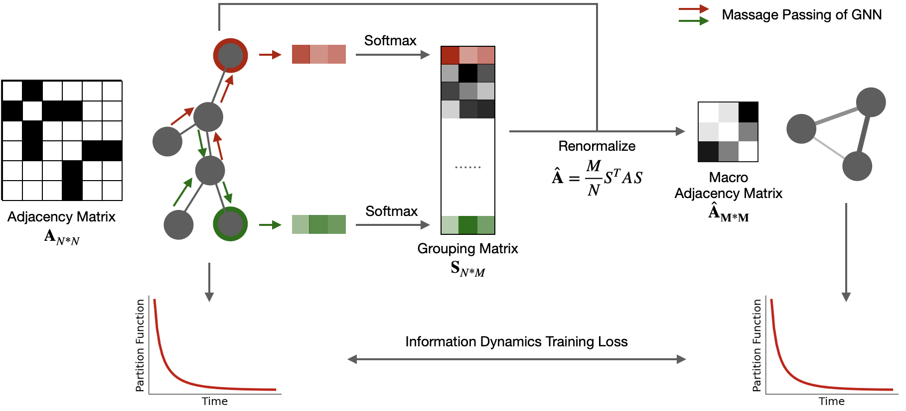

# netIDRG: Network Information Dynamics Renormalization Group

This repository will contain the PyTorch implementation of:
<br>

**Network Information Dynamics Renormalization Group**<br>
Zhang Zhang<sup>\*</sup>, Arsham Ghavasieh, Jiang Zhang, Manlio De Domenico<sup>\*</sup><br>

<sup>\*</sup>(<sup>\*</sup>: Corresponding author) <br>
[Download PDF](https://www.researchsquare.com/article/rs-3503708/v1)<br>



<br>

### Abstract: 

Information dynamics is vital for many complex systems with networked backbones, from cells to societies. Recent advances in statistical physics have enabled capturing the macroscopic network properties, like how diverse the flow pathways are and how fast the signals can transport, based on the network counterparts of entropy and free energy. However, given the computational challenge posed by the large number of components in real-world systems, there is a need for advanced network renormalization--- i.e., compression--- methods providing simpler-to-read representations while preserving the flow of information between functional units across scales. We use graph neural networks to identify suitable groups of components for coarse-graining a network and achieve a low computational complexity suitable for practical application. Even for large compressions, our approach is highly effective in preserving the flow in synthetic and empirical networks, as demonstrated by theoretical analysis and numerical experiments. Remarkably, we find that the model works by merging nodes of similar ecological niches--- i.e., structural properties---, suggesting that they play redundant roles as senders or receivers of information. Our work offers a low-complexity renormalization method breaking the size barrier for meaningful compressions of extremely large networks, working as a multiscale topological lens in preserving the flow of information in biological, social, and technological systems better than existing alternatives mostly focused on structural properties of a network.

### Requirements

- Python 3.7.0
- Pytorch 2.0.1
- torch_geometric 2.4.0

### To Understand how our model works, please see this tutorial:

[Tutorial](https://github.com/3riccc/netIDRG/blob/main/Tutorial_For_A_BA_Network_Renormalization.ipynb)


### Cite
If you use this code in your own work, please cite our paper:
```
Zhang, Z., Ghavasieh, A., Zhang, J., & De Domenico, M. (2023). Network Information Dynamics Renormalization Group.
```